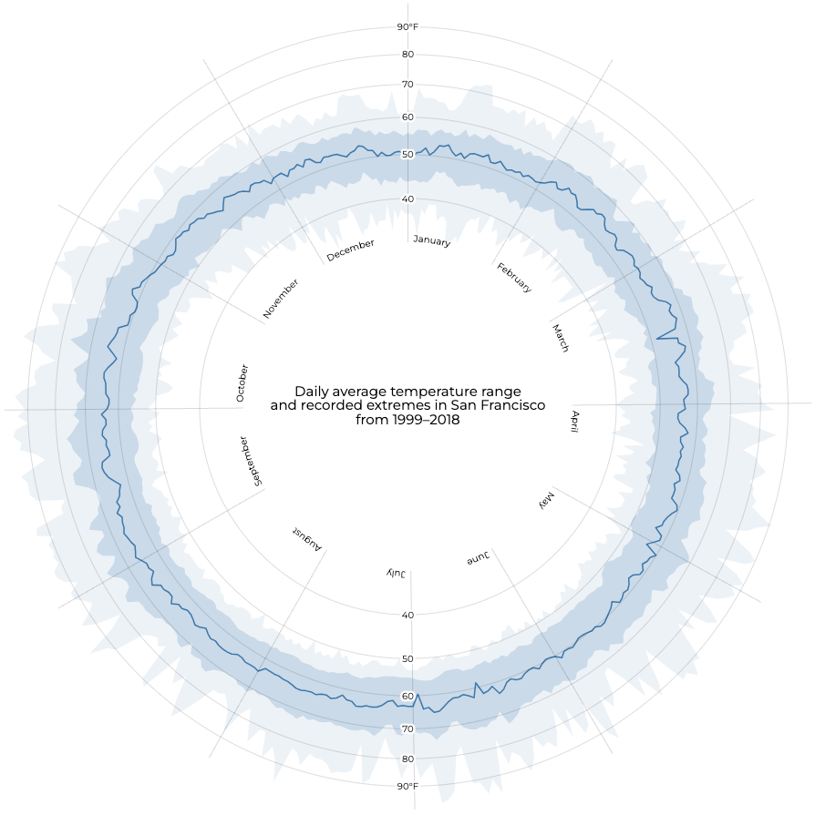
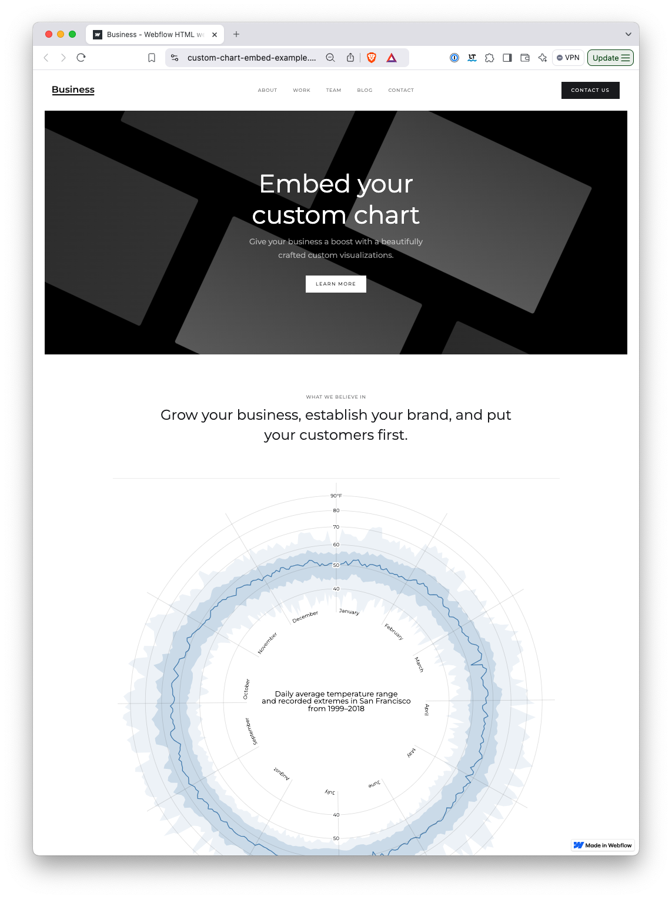

# Custom chart example for blog post "How to embed custom charts in Webflow"

Code inspired from [https://observablehq.com/@d3/radial-area-chart/2](https://observablehq.com/@d3/radial-area-chart/2)

Read blog post here: [https://blog.kristin-baumann.com/how-to-embed-a-custom-chart-in-webflow/](https://blog.kristin-baumann.com/how-to-embed-a-custom-chart-in-webflow/)

Webflow page: https://custom-chart-embed-example.webflow.io/

